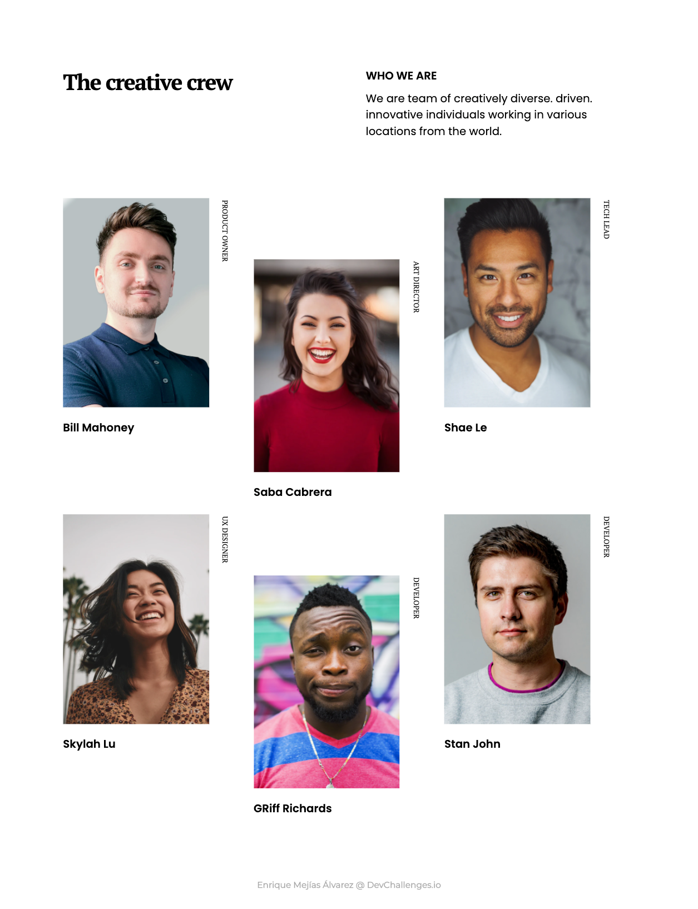

<!-- Please update value in the {}  -->

<h1 align="center">My Team Page Challenge</h1>

   Solution for a challenge from  <a href="http://devchallenges.io" target="_blank">Devchallenges.io</a>.

  <h3>
    <a href="https://myteampage-challenge.netlify.app/">
      Demo
    </a>
     | 
    <!-- <a href="https://{your-url-to-the-solution}"> -->
    <!--   Solution -->
    <!-- </a> -->
    <!--  |  -->
    <a href="https://devchallenges.io/challenges/hhmesazsqgKXrTkYkt0U">
      Challenge
    </a>
  </h3>

<!-- TABLE OF CONTENTS -->

<!-- ## Table of Contents -->

- [Overview](#overview)
  - [Built With](#built-with)
- [Features](#features)
- [Contact](#contact)
- [Acknowledgements](#acknowledgements)

<!-- OVERVIEW -->

## Overview

<!-- Introduce your projects by taking a screenshot or a gif. Try to tell visitors a story about your project by answering: -->

<!-- - Where can I see your demo? -->
<!-- - What was your experience? -->
<!-- - What have you learned/improved? -->
<!-- - Your wisdom? :) -->

### Built With

<!-- This section should list any major frameworks that you built your project using. Here are a few examples.-->

- HTML5
- SASS
- Parcel

## Features

<!-- List the features of your application or follow the template. Don't share the figma file here :) -->

This application/site was created as a submission to a [DevChallenges](https://devchallenges.io/challenges) challenge. The [challenge](https://devchallenges.io/challenges/hhmesazsqgKXrTkYkt0U) was to build an application to complete the given user stories.

## Acknowledgements

This project use [Parcel](https://parceljs.org/) bundler.

## Contact

- GitHub [@kiyov09](https://github.com/kiyov09)
- Twitter [@kiyov09](https://twitter.com/kiyov09)
